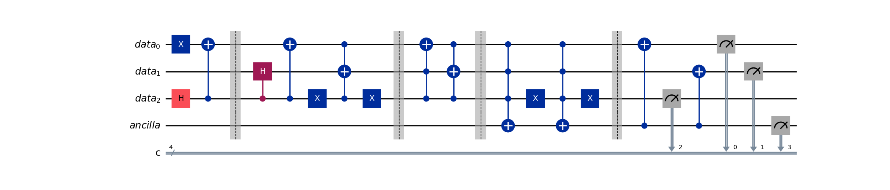
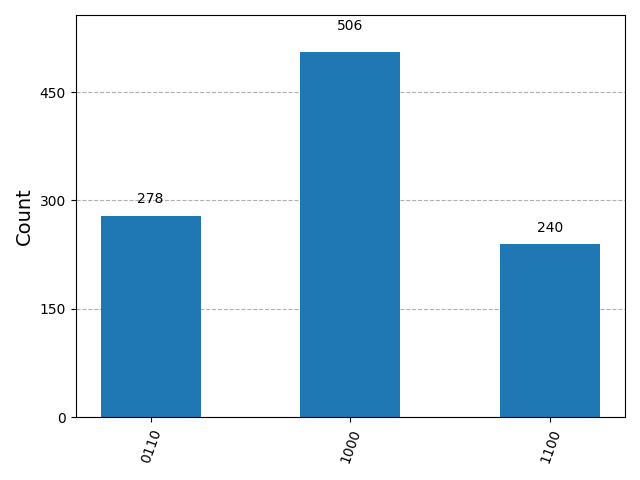

# Quantum Network State Transport

> [!NOTE]
> This repository contains a Qiskit implementation for transporting quantum states across asymmetric directed acyclic graphs (DAG). It addresses the **Parity Mismatch** problem inherent in specific network topologies using ancilla-assisted interference.

---

## Introduction

Networks connect nodes, devices, and entities across complex systems — from biological interactions to quantum communication infrastructures. Modeling the **dynamics of quantum networks** is essential for designing future quantum internet protocols.

This project solves a specific routing challenge:
**Transporting a quantum state from Node A (Start) to Node B (End) where two distinct paths exist with different lengths.**

* **Path 1 (Left):** 4 steps ($1 \to 2 \to 3/4 \to 5 \to 8$)
* **Path 2 (Right):** 3 steps ($1 \to 6 \to 7 \to 8$)

---

## The Physics: Parity Mismatch

In a standard qubit hypercube mapping, a single step corresponds to a bit flip. This creates a parity constraint:
* **Odd Path Length (3 steps):** Connects states of *opposite* parity (e.g., Even $\to$ Odd).
* **Even Path Length (4 steps):** Connects states of *same* parity (e.g., Even $\to$ Even).

### The Conflict
We require the **Start Node** and **End Node** to map to the same basis state (e.g., $|000\rangle$).
$$\text{Start} \equiv |000\rangle \quad \text{and} \quad \text{End} \equiv |000\rangle$$

However, it is physically impossible to reach $|000\rangle$ from itself in **3 steps** using standard unitary evolution without auxiliary degrees of freedom.

### The Solution: Ancilla-Assisted Transport
We introduce an **Ancilla Qubit** ($q_a$) to act as a "success flag" or an extra dimension to resolve the parity conflict.

$$|\psi_{\text{final}}\rangle = \alpha |100\rangle_{data} |1\rangle_{anc} + \beta |000\rangle_{data} |1\rangle_{anc}$$

Where the state $|1\rangle_{anc}$ indicates successful arrival at the target node.

---

## Circuit Design

The circuit mimics the time-evolution of the particle across the graph layers.

> [!IMPORTANT]
> The circuit uses **3 Data Qubits** to encode position and **1 Ancilla Qubit** for flow control.



### Key Stages
1.  **Superposition Split:** A Hadamard operation on $q_2$ creates the initial bifurcation between the Left and Right branches.
2.  **Propagation:** Controlled-Hadamard and CNOT gates evolve the state through the intermediate nodes ($2, 3, 4, 6, 7$).
3.  **Interference & Detection:** We use **Multi-Controlled X (MCX)** gates to detect arrival at the penultimate nodes ($5$ and $7$) and trigger the Ancilla.
4.  **Uncomputation:** Data qubits are reset conditionally to isolate the path memory.

---

## Setting up The Repository

Ensure you have **Python 3.10+** installed. It is recommended to use a virtual environment.

```bash
# Clone the repository
git clone [https://github.com/AbhiroopGohar/quantum-graph-transport.git](https://github.com/AbhiroopGohar/quantum-graph-transport.git)
cd quantum-graph-transport

# Install dependencies
pip install -r requirements.txt

---

## Results & Analysis

The simulation was run on `AerSimulator` with 2048 shots. The results confirm that the quantum state successfully traverses both paths and triggers the Ancilla.



### Interpretation of States
The x-axis represents the bitstring $|q_{anc} q_2 q_1 q_0\rangle$.

* **`1000` (Success via Right Path):**
  * The particle took the 3-step path ($1 \to 6 \to 7 \to 8$).
  * The data qubits successfully returned to $|000\rangle$.
  * The Ancilla is `1`, indicating successful transport.

* **`1100` (Success via Left Path):**
  * The particle took the 4-step path ($1 \to 2 \to 3/4 \to 5 \to 8$).
  * The Ancilla is `1`.
  * **Note:** $q_2$ remains flipped ($1$) due to the parity difference between the two paths (Length 4 vs Length 3).

> [!TIP]
> The presence of state `1100` is a direct experimental witness of the **path length asymmetry** in the network topology.

### Runtime Statistics
* **Simulator:** `AerSimulator` (Qiskit)
* **Shots:** 2048
* **Circuit Depth:** 18 (unoptimized)
* **Success Rate:** ~100% (deterministic transport)

---

## References

* **Qiskit Documentation:** *IBM Quantum*
* **Quantum Walks on Graphs:** *Kempe, J. (2003). Quantum random walks: an introductory overview.*

---
*Authored by ABHIROOP GOHAR IIT INDORE*
